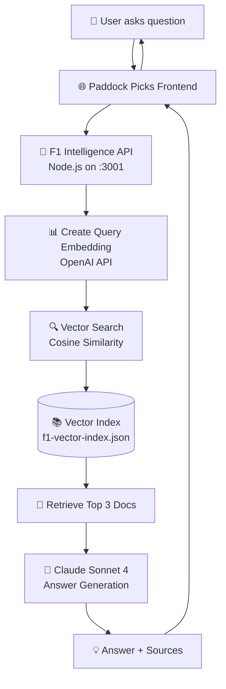
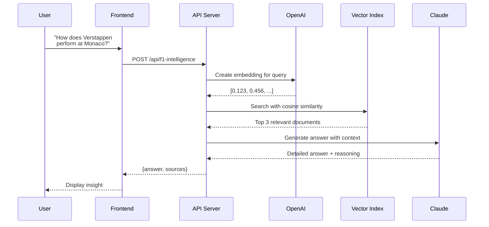
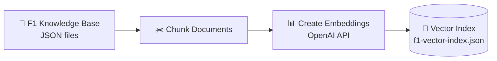
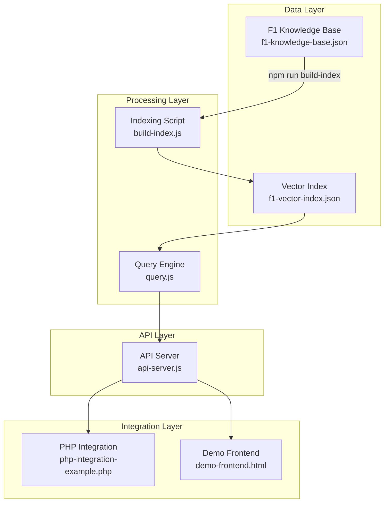

# F1 RAG System Architecture

## High-Level Flow

```mermaid
graph TB
    User[👤 User asks question] --> Frontend[🌐 Paddock Picks Frontend]
    Frontend --> API[🚀 F1 Intelligence API<br/>Node.js on :3001]
    API --> Embed[📊 Create Query Embedding<br/>OpenAI API]
    Embed --> Search[🔍 Vector Search<br/>Cosine Similarity]
    Search --> VectorDB[(📚 Vector Index<br/>f1-vector-index.json)]
    VectorDB --> TopK[📄 Retrieve Top 3 Docs]
    TopK --> Claude[🤖 Claude Sonnet 4<br/>Answer Generation]
    Claude --> Response[💡 Answer + Sources]
    Response --> Frontend
    Frontend --> User
```

## Data Flow Example

```mermaid
sequenceDiagram
    participant U as User
    participant F as Frontend
    participant A as API Server
    participant O as OpenAI
    participant V as Vector Index
    participant C as Claude

    U->>F: "How does Verstappen<br/>perform at Monaco?"
    F->>A: POST /api/f1-intelligence
    A->>O: Create embedding for query
    O-->>A: [0.123, 0.456, ...]
    A->>V: Search with cosine similarity
    V-->>A: Top 3 relevant documents
    A->>C: Generate answer with context
    C-->>A: Detailed answer + reasoning
    A-->>F: {answer, sources}
    F-->>U: Display insight
```

## Indexing Process (One-Time)

```mermaid
graph LR
    KB[📄 F1 Knowledge Base<br/>JSON files] --> Chunk[✂️ Chunk Documents]
    Chunk --> Embed[📊 Create Embeddings<br/>OpenAI API]
    Embed --> Store[(💾 Vector Index<br/>f1-vector-index.json)]
```

## System Components

```mermaid
graph TB
    subgraph "Data Layer"
        KB[F1 Knowledge Base<br/>f1-knowledge-base.json]
        VI[Vector Index<br/>f1-vector-index.json]
    end
    
    subgraph "Processing Layer"
        Index[Indexing Script<br/>build-index.js]
        Query[Query Engine<br/>query.js]
    end
    
    subgraph "API Layer"
        Server[API Server<br/>api-server.js]
    end
    
    subgraph "Integration Layer"
        PHP[PHP Integration<br/>php-integration-example.php]
        Frontend[Demo Frontend<br/>demo-frontend.html]
    end
    
    KB -->|npm run build-index| Index
    Index --> VI
    VI --> Query
    Query --> Server
    Server --> PHP
    Server --> Frontend
```
